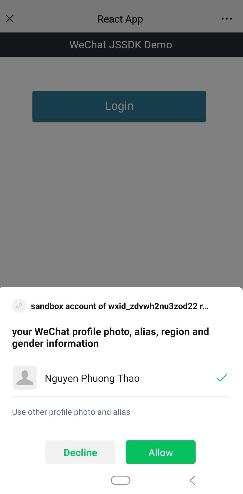
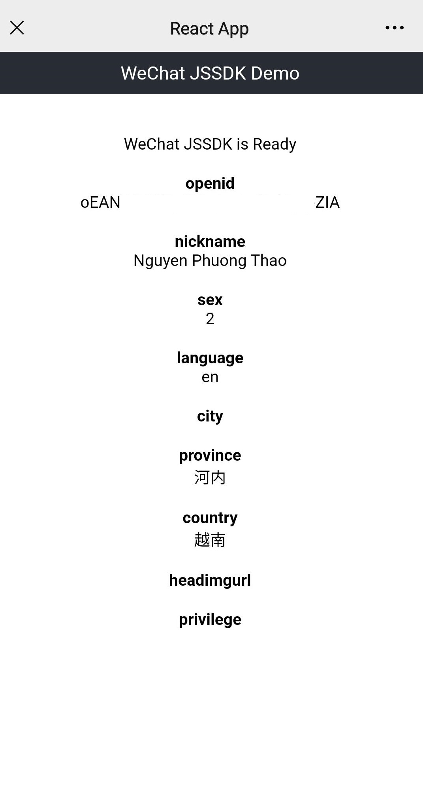
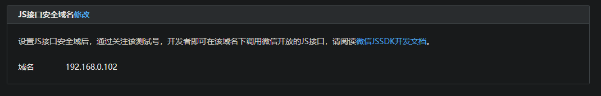
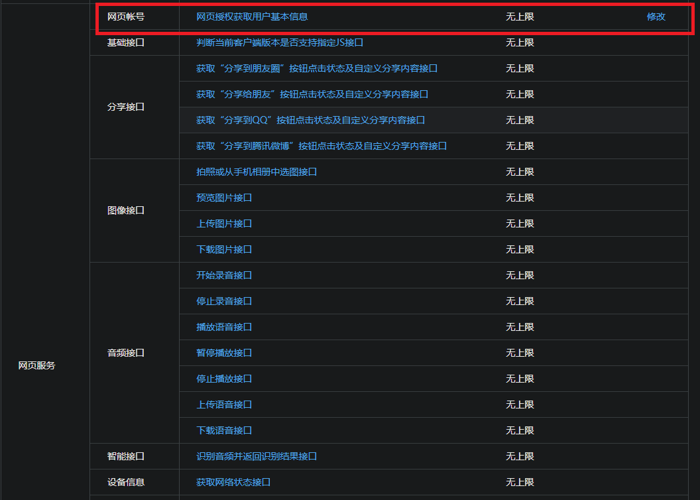
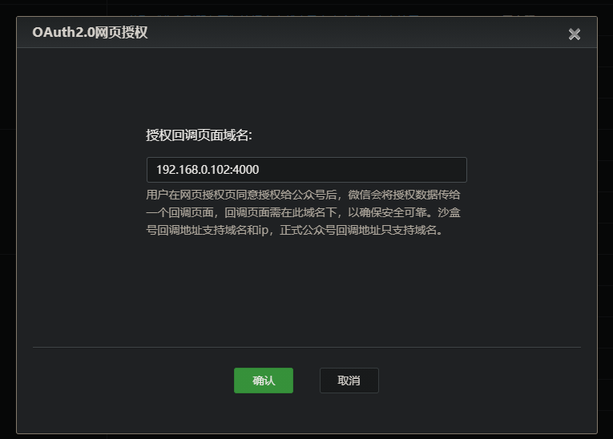
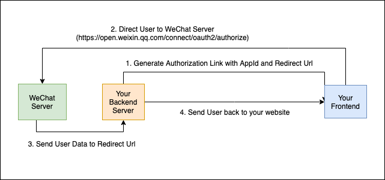

# WeChat OAuth Login Demo

## Prerequisites
* A WeChat Account
* Node & NPM
* An Official Account or Test account (AppID and AppSecret)

## Result



Hiding OpenId.

## Developer Tools
* [Sandbox testing Account](http://mp.weixin.qq.com/debug/cgi-bin/sandbox?t=sandbox/login): The process of having a verified and validated account is tedious, could take several days, and maybe costly (depending on the type of app you want to make).
* [Official Web Debug tool](https://developers.weixin.qq.com/doc/offiaccount/en/OA_Web_Apps/Web_Developer_Tools.html#5). [Download](https://developers.weixin.qq.com/miniprogram/en/dev/devtools/download.html). You have to be within wechat app for this to work. The debug tool could mimic that.

## Install Guide
### Whitelist Domain Name
I'm using the test account so this will only guide from the menu of test account.

You should use the local IP address for local testing (localhost is fine). Write the domain without http or https.



### Config Callback URL
Continue to scroll down to config the callback URL.


Enter the callback URL.


### Backend
Go to `backend` folder
```
npm i
npm run dev (if you have nodemon) or
npm start
```

Create a `.env` file, input your AppId and AppSecret with this format:
```
APP_ID=wxe04ec8dd73095919
APP_SECRET=3b472b691b6ee18da8a91c51cff0be59
```

There should be a wechat-info.json generated after you start the app.

### Frontend
Go to `frontend` folder
```
npm i
npm start
```

## Explanation
### Workflow


The Authorization Link is with the format:
https://open.weixin.qq.com/connect/oauth2/authorize?appid=APPID&redirect_uri=REDIRECT_URI&response_type=code&scope=SCOPE&state=STATE#wechat_redirect

There is two scope for authorization:
- The scope is snsapi_base (user authorization prompt is not required)
- The scope is snsapi_userinfo (user authorization prompt is required)

We are using snsapi_userinfo.


## References
* https://developers.weixin.qq.com/doc/oplatform/en/Mobile_App/WeChat_Login/Development_Guide.html
* https://blog.shanghaicoders.com/how-to-set-up-wechat-js-sdk-efc773c43c1e
* https://developers.weixin.qq.com/doc/offiaccount/en/OA_Web_Apps/Wechat_webpage_authorization.html
